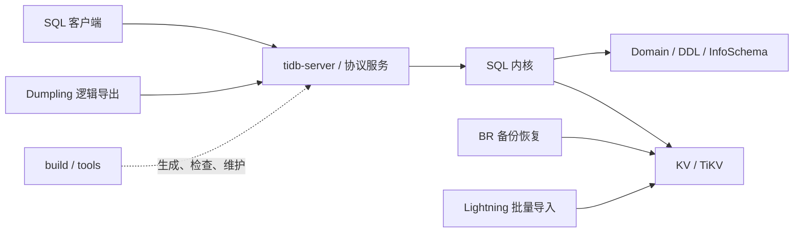
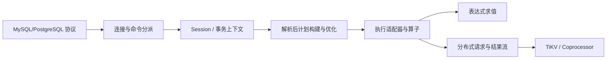
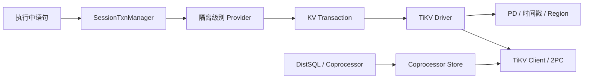
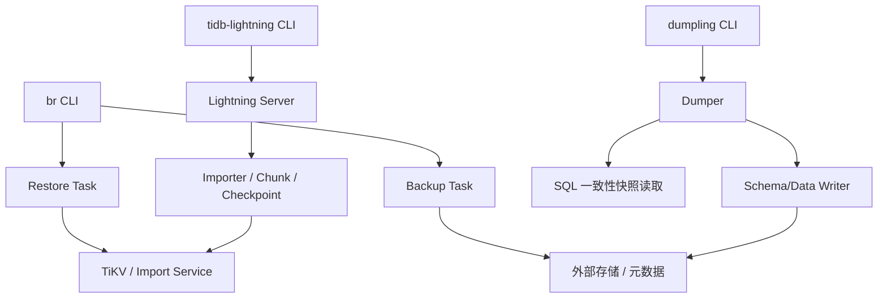

# AsterSQL Rust 整体架构

本文从 2598 份逐文件说明反向汇总当前 Rust 实现。图中的节点均可点击到源码旁的说明文档；图后的“边证据”明确给出每条跨层关系的复核入口。装配文件虽不在逐文件清单中，进程入口及模块边界仍由业务实现文档覆盖。

## 部署角色与分层

AsterSQL Rust workspace 包含在线 SQL 服务、共享数据库内核、离线数据工具和构建辅助面。在线主链以 `tidb-server` 为进程入口，经协议服务、会话、计划与执行层访问事务和分布式存储；Domain 持有实例级元数据、DDL、统计信息及后台任务生命周期。BR、Lightning、Dumpling 分别承担备份恢复、批量导入和逻辑导出，不经过完整的在线 SQL 请求入口，但复用配置、元数据、存储和工具基础设施。

边证据：客户端接入与内核创建见 [`pkg/server/server.rs.md`](../../pkg/server/server.rs.md)；在线内核初始化、Domain 与存储接线见 [`cmd/tidb-server/main.rs.md`](../../cmd/tidb-server/main.rs.md)；工具到存储/SQL 的边界分别见 [`br/cmd/br/backup.rs.md`](../../br/cmd/br/backup.rs.md)、[`lightning/pkg/importer/import.rs.md`](../../lightning/pkg/importer/import.rs.md) 和 [`dumpling/export/dump.rs.md`](../../dumpling/export/dump.rs.md)；构建辅助面的职责见 [`tools/tazel/main.rs.md`](../../tools/tazel/main.rs.md)。

## SQL 请求主链

边证据：协议到连接循环见 [`pkg/server/conn.rs.md`](../../pkg/server/conn.rs.md)；连接创建具体会话见 [`pkg/server/driver_tidb.rs.md`](../../pkg/server/driver_tidb.rs.md)；会话到计划/执行的运行时桥接见 [`pkg/session/runtime/session.rs.md`](../../pkg/session/runtime/session.rs.md)；语句到计划见 [`pkg/planner/core/planbuilder.rs.md`](../../pkg/planner/core/planbuilder.rs.md)；执行器、表达式与远端结果流见 [`pkg/executor/adapter.rs.md`](../../pkg/executor/adapter.rs.md)、[`pkg/expression/expression.rs.md`](../../pkg/expression/expression.rs.md)、[`pkg/distsql/select_result.rs.md`](../../pkg/distsql/select_result.rs.md)。

## 元数据与 DDL 链

```mermaid
flowchart LR
  SQL[DDL SQL] --> DDLExec[DDL Executor]
  DDLExec --> Submit[Job Submitter]
  Submit --> Queue[持久化 Job / Meta]
  Queue --> Owner[DDL Owner / Scheduler]
  Owner --> Worker[Job Worker / Reorg]
  Worker --> Meta[Meta 版本与对象]
  Meta --> Info[InfoSchema 快照]
  Info --> Domain[Domain 缓存与租约同步]
  Domain --> Session[会话可见 Schema]
  click SQL "../../pkg/ddl/executor.rs.md"
  click DDLExec "../../pkg/ddl/ddl.rs.md"
  click Submit "../../pkg/ddl/job_submitter.rs.md"
  click Queue "../../pkg/meta/meta.rs.md"
  click Owner "../../pkg/ddl/owner_mgr.rs.md"
  click Worker "../../pkg/ddl/job_worker.rs.md"
  click Meta "../../pkg/meta/meta.rs.md"
  click Info "../../pkg/infoschema/infoschema.rs.md"
  click Domain "../../pkg/domain/domain.rs.md"
  click Session "../../pkg/session/runtime/session.rs.md"
```

边证据：DDL 任务的提交、状态和完成通知见 [`pkg/ddl/ddl.rs.md`](../../pkg/ddl/ddl.rs.md) 与 [`pkg/ddl/job_submitter.rs.md`](../../pkg/ddl/job_submitter.rs.md)；owner、调度和 worker 推进见 [`pkg/ddl/owner_mgr.rs.md`](../../pkg/ddl/owner_mgr.rs.md)、[`pkg/ddl/job_scheduler.rs.md`](../../pkg/ddl/job_scheduler.rs.md)、[`pkg/ddl/job_worker.rs.md`](../../pkg/ddl/job_worker.rs.md)；版本化元数据到 InfoSchema/Domain 的刷新边界见 [`pkg/meta/meta.rs.md`](../../pkg/meta/meta.rs.md)、[`pkg/infoschema/infoschema.rs.md`](../../pkg/infoschema/infoschema.rs.md)、[`pkg/domain/domain.rs.md`](../../pkg/domain/domain.rs.md)。

## 事务与存储链

边证据：会话事务接口和隔离级别选择见 [`pkg/sessiontxn/interface.rs.md`](../../pkg/sessiontxn/interface.rs.md) 与 [`pkg/sessiontxn/isolation/base.rs.md`](../../pkg/sessiontxn/isolation/base.rs.md)；KV 抽象及事务语义见 [`pkg/kv/kv.rs.md`](../../pkg/kv/kv.rs.md) 和 [`pkg/kv/txn.rs.md`](../../pkg/kv/txn.rs.md)；TiKV 路径解析、PD/TLS/客户端生命周期及事务适配见 [`pkg/store/driver/tikv_driver.rs.md`](../../pkg/store/driver/tikv_driver.rs.md)、[`pkg/store/driver/client_runtime.rs.md`](../../pkg/store/driver/client_runtime.rs.md)、[`pkg/store/driver/txn/txn_driver.rs.md`](../../pkg/store/driver/txn/txn_driver.rs.md)；只读分布式扫描见 [`pkg/store/copr/coprocessor.rs.md`](../../pkg/store/copr/coprocessor.rs.md)。

## 备份、导入与导出链

边证据：BR 根命令向 backup/restore 任务分派见 [`br/cmd/br/main.rs.md`](../../br/cmd/br/main.rs.md)、[`br/cmd/br/backup.rs.md`](../../br/cmd/br/backup.rs.md)、[`br/cmd/br/restore.rs.md`](../../br/cmd/br/restore.rs.md)；Lightning 的一次性/服务模式、导入编排和 checkpoint 见 [`lightning/cmd/tidb-lightning/main.rs.md`](../../lightning/cmd/tidb-lightning/main.rs.md)、[`lightning/pkg/server/lightning.rs.md`](../../lightning/pkg/server/lightning.rs.md)、[`lightning/pkg/importer/import.rs.md`](../../lightning/pkg/importer/import.rs.md)；Dumpling 的配置、快照读取、任务与输出关闭顺序见 [`dumpling/cmd/dumpling/main.rs.md`](../../dumpling/cmd/dumpling/main.rs.md)、[`dumpling/export/dump.rs.md`](../../dumpling/export/dump.rs.md)、[`dumpling/export/writer.rs.md`](../../dumpling/export/writer.rs.md)。

## 关键生命周期与共享状态

- 进程：`tidb-server` 先收敛配置，再按存储、DDL、Domain、协议服务和后台任务的依赖顺序启动；退出信号向下传播并触发逆序清理。入口细节见 [`cmd/tidb-server/main.rs.md`](../../cmd/tidb-server/main.rs.md)。
- 请求：连接拥有协议缓冲与认证状态；Session 拥有语句上下文、事务和可见 InfoSchema；RecordSet/执行器拥有一次查询的结果流与资源计量。入口分别见 [`pkg/server/conn.rs.md`](../../pkg/server/conn.rs.md)、[`pkg/session/runtime/session.rs.md`](../../pkg/session/runtime/session.rs.md)、[`pkg/executor/adapter.rs.md`](../../pkg/executor/adapter.rs.md)。
- 元数据：Domain 通过 `Arc`、锁、原子状态和后台线程共享版本化 InfoSchema、统计信息和 DDL 服务；DDL Job 在持久化状态机与 schema 同步完成后才对所有节点稳定可见。见 [`pkg/domain/domain.rs.md`](../../pkg/domain/domain.rs.md) 与 [`pkg/ddl/ddl.rs.md`](../../pkg/ddl/ddl.rs.md)。
- 存储：driver 缓存已打开的 store，并集中管理 PD、TLS、keepalive、region 与 client runtime；事务和 coprocessor 分别承担读写提交与分布式只读计算。见 [`pkg/store/driver/tikv_driver.rs.md`](../../pkg/store/driver/tikv_driver.rs.md)。
- 离线工具：BR/Lightning/Dumpling 都把取消、进度、checkpoint/一致性和输出关闭放在进程级生命周期内；部分 Rust 文件明确记录了仍未与 Go 完整对齐的桩或简化实现，使用前必须阅读对应文档的“错误处理与边界”和“与 Go 版本的对应关系”。

## 错误、并发与一致性边界

错误沿 `Result`/共享错误类型跨层传播，协议层再转换为客户端可见错误。事务冲突、schema 版本变化和 region 错误属于可重试类别，但重试策略分别位于 session/executor、Domain/InfoSchema 和 TiKV client 边界，不能在任意上层统一吞并。异步任务、线程、通道、锁和取消上下文均以逐文件文档记录的当前实现为准；特别是 DDL owner 单写、多节点 schema 同步、事务 2PC 和离线工具 checkpoint，都是跨进程一致性的关键边界。

## 新增功能的落点

1. 新 SQL 语法先落在 parser/AST，再接入 `PlanBuilder`，随后补逻辑/物理计划与 executor；表达式语义放在 `pkg/expression`，远端下推同时核对 DistSQL/coprocessor 编码边界。
2. 新 DDL 能力从 executor、job 参数/提交、owner worker、meta 与 InfoSchema 刷新链逐段接入，并为状态迁移、失败恢复和 schema 同步设计独立测试。
3. 新存储能力优先扩展 `pkg/kv` 契约，再实现 store driver/transaction/coprocessor 适配；不要让会话层依赖具体 TiKV client。
4. 新离线工具功能应保持 CLI、配置、任务编排、checkpoint/取消、存储 I/O 分层，并逐项核对 Go 行为，不以可编译桩代替真实行为。
5. 阅读或修改任一文件时，从 [阅读索引](./README.md) 定位其同模块上下游，再回到该文件说明中的“依赖与调用关系”“扩展指南”“验证依据”。

## 验证依据与限制

本汇总基于 `docs/docs-manifest.md` 的 2598 个唯一源文件/说明映射；生成时确认源文件、说明文件双向差集均为空，且每份说明都有 11 个固定二级章节。RustCodeGraph 索引覆盖 7032 个 Rust 文件；通过 `node --file` 额外复核了在线入口、Session、PlanBuilder、Executor、Domain、DDL、TiKV driver 以及 BR/Lightning/Dumpling 入口的文件使用关系和源码职责。

本任务不运行 Cargo、Go 或 Bazel。图表达的是当前仓库可由逐文件证据支持的模块关系，而不是对所有路径已具备生产完整性的承诺；具体未接线、桩实现和 Go 差异以各 `*.rs.md` 为准。
