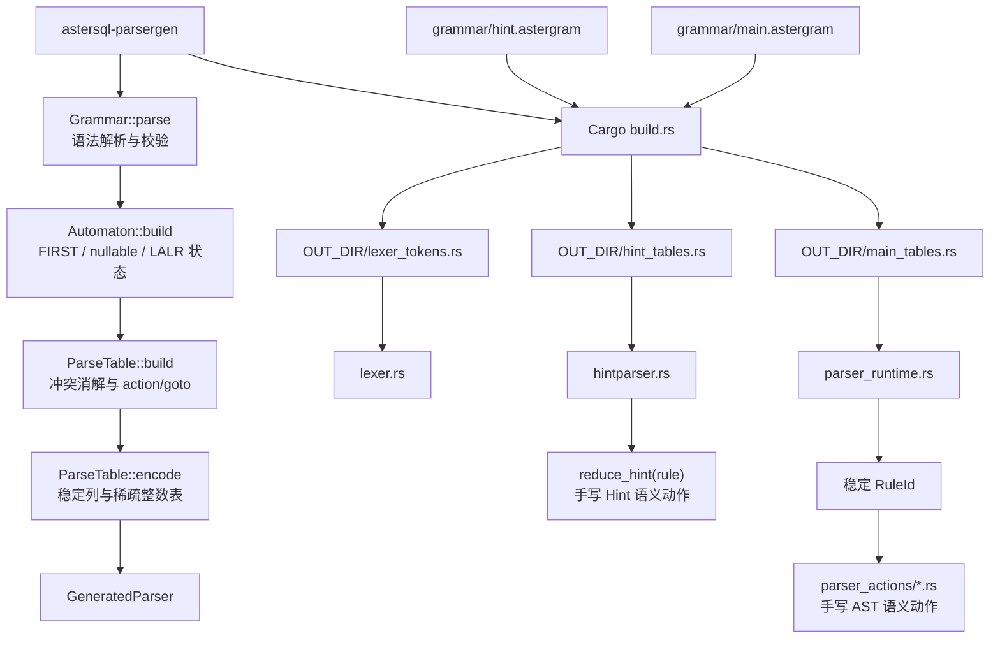

# Rust SQL Parser：语法生成、运行时与 14 批次改造说明

本文基于提交 `726ef52dc`（2026-08-21）的实际代码，说明 `pkg/parser` 当前如何从 Rust 自有语法生成解析器、哪些内容是生成的、哪些内容仍由人工维护，以及本轮 14 个批次最终改变了什么。

## 先给结论

当前 parser 是“编译期按语法动态生成解析表”，不是“运行时动态生成解析器”，也不是“自动生成全部 AST 逻辑”。

- 主 SQL 语法来自 `pkg/parser/grammar/main.astergram`。
- Hint 语法来自 `pkg/parser/grammar/hint.astergram`。
- Cargo 构建 `astersql-parser` 时，`pkg/parser/build.rs` 调用纯 Rust crate `astersql-parsergen`。
- 生成结果写入 Cargo 的 `OUT_DIR`，随后通过 `include!` 编译进 parser。
- 动态生成的是 token、符号列、归约元数据、LALR action/goto 表、稳定 `RuleId` 和 action 覆盖元数据。
- lexer、AST 类型、错误处理、主 parser 语义动作和 Hint 语义动作都是手写 Rust。
- 主 parser 的 2,080 个语义动作已经从数字规则大 switch 迁移为七个按领域拆分的命名 Rust action 模块。
- Hint 的解析表也由 `.astergram` 动态生成，但 Hint 语义动作目前仍由 `hintparser.rs` 中的数字规则 switch 执行。

换句话说：语法决定“输入如何 shift/reduce”，手写 action 决定“归约时构造什么 AST”。

## 整体生成链路



`astersql-parsergen` 是库 crate，不是需要手动运行的 CLI。正常入口就是：

```shell
cargo build -p astersql-parser
```

`cargo check` 和 `cargo test` 同样会触发 `build.rs`。`build.rs` 对两份 `.astergram` 输出 `cargo:rerun-if-changed`，因此语法文件变化后 Cargo 会重新生成表。

## 两份 `.astergram` 是什么

`.astergram` 是本项目自有的、由纯 Rust 解析的语法描述格式。它支持：

- `%start`：起始非终结符。
- `%token`：token 名、固定数字和可选显示字面量。
- `%left`、`%right`、`%nonassoc`、`%precedence`：优先级和结合性。
- `%prec`：产生式级优先级覆盖。
- `ε`：空产生式。
- `@action`：标记该产生式需要执行语义动作。

当前规模如下：

| 语法 | 行数 | token | 产生式 | 带 `@action` 的产生式 |
| --- | ---: | ---: | ---: | ---: |
| `main.astergram` | 4,135 | 928 | 3,124 | 2,080 |
| `hint.astergram` | 338 | 101 | 231 | 65 |

示意产生式：

```text
AlterTableStmt : "ALTER" IgnoreOptional "TABLE" TableName AlterTableSpecListOpt AlterTableSpecSingleOpt @action;
SplitIndexListOpt : ε %prec lowerThanCreateTableSelect @action;
```

注意：`@action` 不包含 Rust 代码。它只告诉生成器“这个归约不能使用默认 `$$ = $1`，必须存在对应语义动作”，并进入 `ACTION_REQUIRED` 覆盖元数据。

## parsergen 内部怎么生成

### 1. 解析和校验语法

`pkg/parser/parsergen/grammar.rs` 中的 `Grammar::parse` 把文本解析为：

- `Token`
- `Precedence`
- `Production`
- `ProductionItem`
- `RuleId`

同时检查重复 token、重复数字、未知符号、重复产生式、非法优先级、缺少起始符等问题，并保留行列位置用于错误报告。

### 2. 为产生式生成稳定 `RuleId`

每条产生式先生成规范签名，签名包含：

- 左部非终结符。
- 有序右部符号或字面量。
- 中间 action 的位置。
- 可选 `%prec`。

`RuleId` 由“最多 48 字符的可读前缀 + FNV-1a 64 位摘要”组成，例如：

```text
emptystmt--bede6c684b818500
```

因此：

- 调整产生式在文件中的顺序不会改变 `RuleId`。
- 修改产生式本身会改变 `RuleId`，对应手写 action 必须同步更新。
- 主 parser action 不再依赖“第 10 条、第 3124 条”这样的脆弱数字身份。

### 3. 构造 LALR(1) 自动机

`pkg/parser/parsergen/automaton.rs` 完成：

1. 语法规范化并加入增广开始规则。
2. 计算 nullable 和 FIRST 集。
3. 构造 LR(0) 核心状态与 GOTO 图。
4. 在相同 LR(0) 核心上合并、传播 lookahead，得到 LALR(1) 状态。

内部广泛使用 `BTreeMap`/`BTreeSet`，确保遍历和状态输出顺序稳定。

### 4. 构造 action/goto 表

`pkg/parser/parsergen/table.rs` 先使用类型化单元：

- `Shift(state)`
- `Reduce(RuleId)`
- `Goto(state)`
- `Accept`
- `Error`

shift/reduce 冲突依据语法中的优先级和结合性消解；无法消解的冲突直接报错，不会静默选择。

最终整数编码为：

| 编码 | 含义 |
| --- | --- |
| `0` | error / 表中无项 |
| 正数 `state + 1` | shift 或 goto |
| 负数 `-(reduction_index + 1)` | reduce |
| `i32::MIN` | accept |

表只保存非零单元，并按列号排序，形成稳定的稀疏行。

### 5. 形成 `GeneratedParser`

`pkg/parser/parsergen/render.rs` 中的 `GeneratedParser::build` 汇总：

- 排序后的 token 编号。
- token 到表列的 XLAT。
- 稳定符号名。
- 归约左部列和右部符号数。
- 稀疏 action/goto 表。
- 每个归约对应的 `RuleId`。
- 每个归约是否要求 action。

`parsergen/render.rs` 还提供通用 Rust 渲染器和只依赖表的 trace 驱动器。当前 parser crate 的正式构建则使用 `pkg/parser/build.rs` 中的 `render_compatibility_tables`，以匹配现有主/Hint runtime 需要的常量布局。

## 实际动态生成了哪些文件

生成文件不写回源码目录，也不提交到 Git；它们位于类似下面的 Cargo 目录：

```text
target/debug/build/astersql-parser-<hash>/out/
```

可以这样定位：

```shell
find target/debug/build -path '*/out/main_tables.rs' -o \
  -path '*/out/hint_tables.rs' -o \
  -path '*/out/lexer_tokens.rs'
```

### `main_tables.rs`

包含：

- 主 parser token 常量模块。
- `GENERATED_MAIN_ACCEPT`。
- `GENERATED_MAIN_XLAT`。
- `GENERATED_MAIN_SYMBOL_NAMES`。
- `RuleId` 和 `RULE_IDS_BY_REDUCTION`。
- `GENERATED_MAIN_REDUCTIONS`。
- `GENERATED_MAIN_LEGACY_RULES`。
- `GENERATED_MAIN_ACTION_REQUIRED`。
- `GENERATED_MAIN_PARSE_TABLE`。

### `hint_tables.rs`

包含：

- Hint token 常量模块。
- `GENERATED_HINT_ACCEPT`。
- `GENERATED_HINT_XLAT`。
- `GENERATED_HINT_SYMBOL_NAMES`。
- `GENERATED_HINT_REDUCTIONS`。
- `GENERATED_HINT_LEGACY_RULES`。
- `GENERATED_HINT_ACTION_REQUIRED`。
- `GENERATED_HINT_PARSE_TABLE`。

当前 `build.rs` 不把 Hint 的 `RuleId` 渲染到 runtime；Hint 语义动作仍通过产生式序号兼容层执行。

### `lexer_tokens.rs`

包含主语法 token 的 `i32` 常量模块，供 `lexer_support` 命名空间中的手写 lexer 使用。

### 为什么还有 `GENERATED_*_LEGACY_RULES`

这个名字容易误导。它现在是“生成归约索引到语法源产生式序号”的兼容映射，用于：

- 主 parser 的 `yyLexerEx::Reduced` 回调仍需要旧式产生式序号。
- Hint 的 `reduce_hint(rule)` 仍按产生式序号执行动作。
- 基线测试把运行时归约重新映射回语法产生式。

它不是主 parser 的 legacy action fallback。`pkg/parser/parser_actions/legacy.rs` 已删除，主 parser 的 AST 动作不会再回退到数字 action switch。

## 运行时如何消费生成表

`pkg/parser/lib.rs` 在两个命名空间中 include 产物：

```text
parser_impl
  ├── main_tables.rs
  ├── parser.rs
  │   ├── parser_value.rs
  │   ├── parser_semantic_support.rs
  │   └── parser_runtime.rs
  └── lexer_support
      ├── lexer_tokens.rs
      ├── hint_tables.rs
      ├── lexer.rs
      └── hintparser.rs
```

### 主 parser

`parser_runtime.rs` 的循环按以下步骤执行：

1. 手写 lexer 产生外部 token 编号和语义值。
2. `GENERATED_MAIN_XLAT` 把 token 编号映射为表列。
3. 在 `GENERATED_MAIN_PARSE_TABLE[state]` 中二分查找动作。
4. 正数执行 shift，负数执行 reduce，`i32::MIN` 接受，`0` 进入错误恢复。
5. reduce 时从 `RULE_IDS_BY_REDUCTION` 取得稳定 `RuleId`。
6. 调用 `parser_actions::apply(rule_id, rhs, context)`。
7. action 填充 `yySymType` 中的 AST、表达式、名称、选项或诊断。
8. 没有 `@action` 的产生式使用默认语义值传递，即移动 `$1` 到 `$$`。

### 主 parser 语义动作

主 parser 的语义动作不是生成出来的，而是以下七个手写模块：

| 模块 | 当前拥有的 action-required `RuleId` 数 |
| --- | ---: |
| `parser_actions/ddl.rs` | 590 |
| `parser_actions/dml.rs` | 95 |
| `parser_actions/expression.rs` | 282 |
| `parser_actions/query.rs` | 234 |
| `parser_actions/security.rs` | 181 |
| `parser_actions/admin.rs` | 545 |
| `parser_actions/misc.rs` | 153 |
| 合计 | 2,080 |

每个模块的 `identify(rule_id)` 把稳定字符串映射为领域内 enum，`apply` 再执行真正的 AST 构造逻辑。全局门禁要求每个 `@action` 规则恰好有一个 owner。

### Hint parser

Hint 的 shift/reduce 表来自 `hint.astergram`，但 `hintparser.rs` 中的 `reduce_hint(rule: usize, ...)` 仍按数字产生式执行手写语义动作。

因此当前状态是：

- Hint 语法和解析表已经独立、可再生成。
- Hint AST 构造仍是手写 Rust。
- Hint action 尚未像主 parser 一样迁移为 runtime 可见的稳定 `RuleId` 分发。

这不是动态生成缺陷，但它是后续若要完全统一主/Hint action 架构时的明确技术债。

## 哪些内容没有动态生成

下面这些仍是源码和行为的人工维护部分：

- `lexer.rs`：扫描 SQL 字节流、识别 token、处理 SQL mode 和注释。
- `keywords.rs`、`misc.rs`：关键字和词法规则支撑。
- `parser_actions/*.rs`：主 parser AST 语义动作。
- `hintparser.rs` 中的 `reduce_hint`：Hint AST 语义动作。
- `parser_semantic_support.rs`：语义值转换和共享辅助逻辑。
- `parser_value.rs`：`Rhs` 与语义栈访问。
- `parser_runtime.rs`：主 parser shift/reduce 循环和错误恢复。
- `hintparser.rs`：Hint runtime 和错误恢复。
- `parser-ast` crate：全部 AST 类型、字段和 restore 行为。
- parser 的行为测试与契约语料。

所以，修改语法通常至少涉及两个位置：

1. 在 `.astergram` 修改产生式。
2. 若产生式带 `@action`，同步新增或更新手写语义动作与测试。

## 14 个批次最终改了什么

14 个批次不是简单替换一个生成器，而是逐层拆除 parser 对旧生成链和数字动作层的耦合。按最终形成的架构层次，可以归纳为以下六组。

### 1. 建立 Rust 自有语法源

- 新增 `grammar/main.astergram` 和 `grammar/hint.astergram`。
- 固定 token 编号、优先级、产生式、空产生式和 action 标记。
- 增加语法清单测试，校验语法与生成归约一一对应。

### 2. 建立纯 Rust parsergen

- 新增独立 `astersql-parsergen` crate。
- 实现 `.astergram` lexer/parser 和静态校验。
- 实现 nullable、FIRST、LR(0) 核心及 LALR lookahead 传播。
- 实现优先级冲突消解、类型化 action/goto 表和稀疏编码。
- 实现稳定 `RuleId`、确定性渲染与 trace 驱动器。

### 3. 把生成接入 Cargo

- `astersql-parser` 将 `astersql-parsergen` 加为 build dependency。
- `build.rs` 只读取两份 `.astergram`，在 `OUT_DIR` 生成三份 Rust 数据文件。
- `lib.rs` 通过 `include!` 编译这些文件。
- 删除 parser workspace 中旧的生成器包装 crate，并移除对应 workspace 接线。

### 4. 拆分运行时与生成数据

- 从原来巨大的 parser 文件中移出静态 token/状态表和数字语义动作。
- 主 shift/reduce 循环集中到 `parser_runtime.rs`。
- 语义栈访问集中到 `parser_value.rs`。
- 共享语义转换集中到 `parser_semantic_support.rs`。
- 主/Hint runtime 都改为消费 Rust parsergen 生成的表。

### 5. 把主 parser 数字 action 迁移为命名 action

- 为产生式引入不受文件顺序影响的稳定 `RuleId`。
- 将原 `parser_actions/legacy.rs` 中的数字规则大 switch 按 DDL、DML、表达式、查询、安全、管理、杂项拆为七个模块。
- 保持原 AST 构造、错误、warning、默认值和边界行为，不做功能简化。
- 增加分域覆盖测试和全局唯一 owner 测试。

### 6. 删除 fallback 并建立独立门禁

- 删除 14,628 行的 `parser_actions/legacy.rs`。
- 主 `parser_actions::apply` 不再回退数字 adapter；未拥有的规则只返回“没有显式 action”。
- 增加无旧 wrapper、无旧生成输入、无数字 action adapter、README 只描述 Rust 流程等门禁。
- 增加生成字节幂等、parsergen 基线、完整 parser 回归和 Rust-only 测试输入检查。

## 与以前版本最关键的区别

| 维度 | 以前 | 现在 |
| --- | --- | --- |
| 语法来源 | parser 构建与旧生成链耦合 | 两份 `.astergram` 是 parser 生成输入 |
| 生成器 | parser 边界外的旧工具/包装链 | `astersql-parsergen` 纯 Rust 库 |
| 生成时机 | 依赖旧流程或冻结生成物 | Cargo 编译期自动生成到 `OUT_DIR` |
| 表身份 | 数字产生式和大数组 | 生成表内部仍整数编码，语义层使用稳定 `RuleId` |
| 主语义动作 | 单个数字规则大 switch | 七个领域模块、2,080 个唯一 owner |
| 主 fallback | 可回退到 legacy action | 已删除 |
| Hint 表 | 旧来源/冻结表 | 从 `hint.astergram` 动态生成 |
| Hint action | 数字 switch | 目前仍是手写数字 switch |
| 可维护性 | 调整规则顺序容易破坏数字映射 | 主 action 由产生式签名定位，重排稳定 |
| 独立性 | parser 构建依赖旧输入或包装 | parser/parsergen 可在 Rust/Cargo 边界独立构建测试 |

## 修改语法的正确流程

### 只改变无语义动作的语法

1. 修改 `main.astergram` 或 `hint.astergram`。
2. 运行 parsergen 测试确认语法、冲突和确定性。
3. 添加 parser 行为测试。
4. 运行完整验证。

### 修改主 parser 的 `@action` 产生式

1. 修改 `main.astergram`。
2. 根据新产生式签名得到新的稳定 `RuleId`。
3. 在正确的 `parser_actions/<domain>.rs` 中更新 `identify` 和 `apply_rule`。
4. 更新同目录独立测试文件。
5. 确认唯一 owner 门禁通过。

### 修改 Hint 的 `@action` 产生式

1. 修改 `hint.astergram`。
2. 检查产生式序号变化对 `GENERATED_HINT_LEGACY_RULES` 和 `reduce_hint(rule)` 的影响。
3. 同步修改 `hintparser.rs` 中的手写动作。
4. 更新 Hint AST 行为测试和生成表基线。

Hint 当前仍按数字动作分发，因此插入或重排产生式时必须比主 parser 更谨慎。

## 验证命令与各自证明的内容

```shell
cargo test -p astersql-parsergen
cargo test -p astersql-parser
cargo check -p astersql-parser
cargo fmt --check -p astersql-parser -p astersql-parsergen
```

| 验证 | 证明什么 |
| --- | --- |
| parsergen grammar 测试 | `.astergram` 解析、校验、稳定 `RuleId` |
| automaton 测试 | nullable、FIRST、闭包、LALR 核心合并和状态稳定性 |
| table 测试 | 冲突消解、稀疏编码、确定性 |
| render 测试 | 相同输入生成字节一致 |
| manifest 测试 | `.astergram` 产生式与编译进 runtime 的归约元数据一致 |
| baseline trace 测试 | 新生成器和 runtime 表在 token 流上的 shift/reduce 轨迹一致 |
| action owner 测试 | 主 parser 每个 `@action` 恰好有一个命名 owner |
| parser 行为测试 | AST、错误、Hint、SQL mode 和边界输入行为 |
| no-legacy 门禁 | parser 构建和测试不重新引入旧 wrapper、旧输入或数字 fallback |

这些测试能证明新架构内部一致和已有语料不回归。若要证明与某个历史提交对所有输入完全等价，仍应额外运行旧、新 parser 的 A/B 差分语料回归；当前生成表基线不能替代跨版本语义差分。

## 维护者检查清单

- `.astergram` 是否是唯一被修改的语法输入？
- token 数字是否保持唯一和兼容？
- 新冲突是否通过明确优先级解决，而非隐藏选择？
- 主 `@action` 是否有且只有一个 `RuleId` owner？
- Hint 产生式序号是否影响 `reduce_hint`？
- AST、错误、warning、offset 和默认 `$$ = $1` 是否有行为测试？
- 生成是否字节可复现？
- parser/parsergen 全测试、check 和 fmt 是否通过？
- 是否避免提交 `OUT_DIR` 生成文件？

